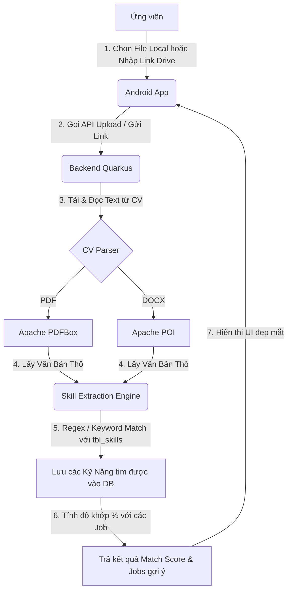

# Kế Hoạch Triển Khai Mapping CV Và Gợi Ý Công Việc Theo Kỹ Năng (WorkHub)

Tài liệu này cung cấp kế hoạch chi tiết để xây dựng tính năng trích xuất kỹ năng (Skills) từ CV của ứng viên (tải lên trực tiếp hoặc qua liên kết Google Drive), đối sánh với yêu cầu kỹ năng của nhà tuyển dụng và đưa ra danh sách các công việc phù hợp kèm theo điểm số độ khớp tương ứng.

---

## 1. Tổng Quan Luồng Nghiệp Vụ (Workflow Overview)

Luồng hoạt động chính của tính năng được chia thành các bước sau:



---

## 2. Thiết Kế Cơ Sở Dữ Liệu (Database Design)

Để tối ưu hóa hiệu năng và tránh việc phải đọc lại file CV mỗi lần hiển thị hoặc tìm kiếm, hệ thống sẽ lưu trữ các kỹ năng trích xuất từ CV vào một bảng quan hệ nhiều-nhiều (`tbl_resume_skill`).

### 2.1 Bảng trung gian `tbl_resume_skill`

> [!NOTE]
> Bảng này liên kết thực thể `Resume` (CV của ứng viên) với `Skill` (Danh mục kỹ năng có sẵn trong hệ thống).

```sql
CREATE TABLE tbl_resume_skill (
    resume_id BIGINT NOT NULL,
    skill_id BIGINT NOT NULL,
    PRIMARY KEY (resume_id, skill_id),
    CONSTRAINT fk_resume FOREIGN KEY (resume_id) REFERENCES tbl_resumes(id) ON DELETE CASCADE,
    CONSTRAINT fk_skill FOREIGN KEY (skill_id) REFERENCES tbl_skills(id) ON DELETE CASCADE
);
```

### 2.2 Entity Java (Quarkus Hibernate ORM - Active Record / Panache)

Cập nhật thực thể `Resume.java` để ánh xạ quan hệ này:

```java
// Trong file Resume.java
@ManyToMany(fetch = FetchType.LAZY)
@JoinTable(
    name = "tbl_resume_skill",
    joinColumns = @JoinColumn(name = "resume_id"),
    inverseJoinColumns = @JoinColumn(name = "skill_id")
)
public List<Skill> skills = new ArrayList<>();
```

---

## 3. Triển Khai Backend (Quarkus)

### 3.1 Thư Viện Trích Xuất Văn Bản (Text Extraction)

Thêm các dependency sau vào `pom.xml` của Backend để xử lý đọc file PDF và Word:

```xml
<!-- Đọc file PDF -->
<dependency>
    <groupId>org.apache.pdfbox</groupId>
    <artifactId>pdfbox</artifactId>
    <version>2.0.29</version>
</dependency>

<!-- Đọc file Word (.docx) -->
<dependency>
    <groupId>org.apache.poi</groupId>
    <artifactId>poi-ooxml</artifactId>
    <version>5.2.3</version>
</dependency>
```

### 3.2 Bộ Phân Tích Đường Dẫn Google Drive (Google Drive Parser)

Khi người dùng cung cấp link Drive, hệ thống cần trích xuất `File ID` để tải file thô về xử lý.

> [!TIP]
> Một link Google Drive chia sẻ công khai có định dạng: `https://drive.google.com/file/d/{FILE_ID}/view?usp=sharing` or `https://drive.google.com/open?id={FILE_ID}`.
> Chúng ta có thể dùng Regex để lấy `{FILE_ID}` và tải trực tiếp qua URL: `https://docs.google.com/uc?export=download&id={FILE_ID}`.

```java
public class DriveLinkUtil {
    private static final Pattern DRIVE_ID_PATTERN = Pattern.compile("/d/([a-zA-Z0-9-_]+)|id=([a-zA-Z0-9-_]+)");

    public static String extractFileId(String url) {
        Matcher matcher = DRIVE_ID_PATTERN.matcher(url);
        if (matcher.find()) {
            return matcher.group(1) != null ? matcher.group(1) : matcher.group(2);
        }
        throw new IllegalArgumentException("Đường dẫn Google Drive không hợp lệ hoặc không đúng định dạng chia sẻ.");
    }

    public static String getDirectDownloadUrl(String fileId) {
        return "https://docs.google.com/uc?export=download&id=" + fileId;
    }
}
```

### 3.3 Thuật Toán Nhận Diện Kỹ Năng (Skill Matching Engine)

1. **Lấy danh sách Skill từ DB**: Truy vấn toàn bộ skill đang kích hoạt (`Skill.findAllActive()`).
2. **Chuẩn hóa văn bản CV**: Chuyển đổi văn bản của CV về chữ thường (lowercase) và loại bỏ các ký tự đặc biệt thừa.
3. **Keyword Matching với Regex**:
   - Sử dụng cơ chế Word Boundary `\b` trong Regex để tránh so khớp sai (ví dụ: skill "C" không bị so khớp nhầm trong từ "Candidate").
   - Quản lý **Từ đồng nghĩa (Synonyms)**: Mỗi Skill trong cơ sở dữ liệu có thể cấu hình thêm cột `aliases` (ví dụ: skill "ReactJS" có aliases là `["react", "react.js", "reactjs"]`).

```java
public List<Skill> extractSkillsFromText(String cvText) {
    List<Skill> allSkills = Skill.findAllActive();
    List<Skill> matchedSkills = new ArrayList<>();
    String normalizedText = cvText.toLowerCase();

    for (Skill skill : allSkills) {
        // Tạo pattern tìm kiếm không phân biệt chữ hoa thường và bao bọc bởi boundary \b
        String skillName = skill.name.toLowerCase();
        Pattern pattern = Pattern.compile("\\b" + Pattern.quote(skillName) + "\\b");
        
        if (pattern.matcher(normalizedText).find()) {
            matchedSkills.add(skill);
        }
    }
    return matchedSkills;
}
```

### 3.4 API Endpoints Mới

Hệ thống sẽ cung cấp các endpoint sau trong `ResumeResource` hoặc một resource mới:

| Phương Thức | Endpoint | Quyền Hạn | Mô Tả |
| :--- | :--- | :--- | :--- |
| `POST` | `/api/v1/resumes/upload` | `CANDIDATE` | Upload file CV local (`multipart/form-data`), trích xuất text, lưu thông tin CV và trả về các skill hệ thống tìm thấy để ứng viên kiểm tra. |
| `POST` | `/api/v1/resumes/import-drive` | `CANDIDATE` | Truyền link Google Drive, Backend tải file về, trích xuất kỹ năng tương tự như upload local. |
| `GET` | `/api/v1/resumes/{id}/matching-jobs` | `CANDIDATE` | Trả về danh sách các công việc phù hợp với kỹ năng có trong CV số `{id}`, sắp xếp theo Match Score giảm dần. |
| `GET` | `/api/v1/jobs/{id}/matching-resumes` | `RECRUITER` | Cho phép nhà tuyển dụng xem danh sách các CV đã nộp vào Job `{id}` được chấm điểm match kỹ năng từ cao xuống thấp. |

### 3.5 Công Thức Tính Điểm Phù Hợp (Match Score)

Để xếp hạng, ta sử dụng công thức tính tỉ lệ phần trăm trùng khớp đơn giản nhưng hiệu quả:

$$\text{Match Score (\%)} = \left( \frac{\text{Số lượng Skill trùng khớp giữa CV và Job}}{\text{Tổng số lượng Skill mà Job yêu cầu}} \right) \times 100$$

> [!TIP]
> Nếu Job yêu cầu 4 kỹ năng (`Java`, `Spring Boot`, `MySQL`, `Git`) và CV của ứng viên có 3 kỹ năng (`Java`, `MySQL`, `Git`), Match Score sẽ là:
> $$\frac{3}{4} \times 100 = 75\%$$

---

## 4. Triển Khai Frontend (Android App)

### 4.1 Giao Diện Tải Lên CV (Upload UI)

Giao diện sẽ cung cấp hai phương thức rõ ràng bằng cách sử dụng Tabs hoặc Radio Buttons:

1. **Tải lên từ thiết bị (Local File)**:
   - Sử dụng `ActivityResultLauncher` với `GetContent()` hoặc `OpenDocument()` để mở trình chọn file hệ thống.
   - Giới hạn định dạng chọn: `.pdf`, `.docx`.
2. **Nhập đường dẫn Google Drive**:
   - Sử dụng một `TextInputLayout` với EditText cho phép dán liên kết Drive.
   - Thêm nút kiểm tra tính hợp lệ của link trước khi gửi.

```kotlin
// Ví dụ mở File Picker trên Android (Kotlin)
val selectFileLauncher = registerForActivityResult(ActivityResultContracts.GetContent()) { uri: Uri? ->
    uri?.let {
        // Xử lý đọc File Stream và gửi Multipart lên Backend
        uploadCvFile(it)
    }
}

// Kích hoạt khi người dùng nhấn nút chọn file
selectFileLauncher.launch("application/pdf")
```

### 4.2 Giao Diện Gợi Ý Việc Làm Phù Hợp (Job Match UI)

Hiển thị danh sách các công việc khớp kèm theo giao diện cực kỳ bắt mắt:
- **Thanh Progress Bar hình tròn (Circular Indicator)** hiển thị phần trăm phù hợp (ví dụ: `85% Match`). Sử dụng màu sắc động:
  - **Màu Xanh Lá (Green)** cho mức match >= 80%.
  - **Màu Cam (Orange)** cho mức match từ 50% - 79%.
  - **Màu Đỏ/Xám (Red/Gray)** cho mức match dưới 50%.
- **Skill Badges**:
  - Các kỹ năng trùng khớp hiển thị chip màu xanh lá kèm icon tích chọn `✓`.
  - Các kỹ năng còn thiếu hiển thị dạng nét đứt (dashed border) màu xám để ứng viên biết cần cải thiện thêm kỹ năng nào.

---

## 5. Lộ Trình Triển Khai (Implementation Roadmap)

Chúng ta sẽ thực hiện theo 4 giai đoạn cụ thể dưới đây:

### Giai Đoạn 1: Cập Nhật Database & Model Quarkus
- [ ] Thêm bảng liên kết trung gian `tbl_resume_skill` trong cơ sở dữ liệu.
- [ ] Cập nhật Entity `Resume.java` để bổ sung quan hệ `@ManyToMany` với `Skill`.
- [ ] Viết DTO `ResumeDetailResponse` chứa thêm danh sách `skills` đi kèm.

### Giai Đoạn 2: Xây Dựng Bộ Trích Xuất & Xử Lý CV ở Backend
- [ ] Thích hợp thư viện `Apache PDFBox` và `Apache POI` vào project Quarkus.
- [ ] Viết `CvTextExtractorService` hỗ trợ đọc nội dung văn bản từ luồng InputStream của file PDF/Word.
- [ ] Tạo helper phân tích link Google Drive, chuyển đổi link chia sẻ thành link tải trực tiếp.
- [ ] Viết thuật toán Regex khớp từ khóa thông minh (không phân biệt hoa thường, chống khớp sai các chữ cái đơn lẻ).

### Giai Đoạn 3: Triển Khai API Matching & Xếp Hạng
- [ ] Xây dựng endpoint upload file local và import link Drive.
- [ ] Viết hàm tính toán Match Score giữa CV và các Job đang tuyển dụng.
- [ ] Tạo API trả về danh sách Jobs phù hợp sắp xếp theo điểm số dành cho ứng viên.
- [ ] Tạo API xếp hạng ứng viên nộp hồ sơ dành cho nhà tuyển dụng.

### Giai Đoạn 4: Thiết Kế UI Android App & Kết Nối API
- [ ] Thiết kế màn hình lựa chọn upload CV (File từ máy / Dán link Drive).
- [ ] Thiết kế màn hình xem lại kỹ năng trích xuất và kết quả khớp việc làm (với Badge màu sắc bắt mắt).
- [ ] Tích hợp API và kiểm thử thực tế với các mẫu CV thực tế (PDF tiếng Việt & tiếng Anh).

---

## 6. Đánh Giá Khó Khăn & Giải Pháp (Risks & Mitigations)

> [!WARNING]
> **Khó khăn 1: Quyền truy cập link Google Drive**
> - *Mô tả*: Ứng viên gửi link Drive nhưng đặt ở chế độ riêng tư (Private). Backend sẽ không thể tải file và trả về lỗi 403.
> - *Giải pháp*: Trên giao diện Android, hiển thị hướng dẫn ngắn kèm hình ảnh minh họa cách chuyển quyền chia sẻ của file sang **"Bất kỳ ai có liên kết đều có thể xem" (Anyone with the link can view)** trước khi dán link.

> [!WARNING]
> **Khó khăn 2: Trích xuất tiếng Việt có dấu**
> - *Mô tả*: Một số file PDF xuất từ công cụ thiết kế (như Canva) bị lỗi font khiến việc đọc văn bản thô ra các ký tự lạ hoặc mất dấu, làm hỏng thuật toán khớp từ khóa.
> - *Giải pháp*: Chuẩn hóa chuỗi văn bản trích xuất về dạng không dấu (Unidecode) khi so khớp, đồng thời cấu hình cả từ khóa có dấu và không dấu trong danh mục skill.
