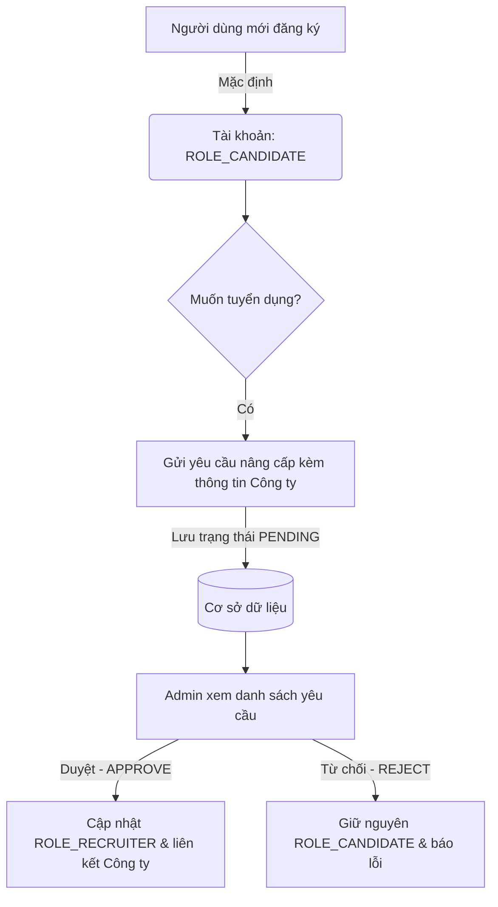

# Kế hoạch Thực hiện: Phân quyền Đăng ký Mặc định & Quy trình Duyệt Nhà Tuyển dụng (Employer Role Upgrade)

Tài liệu này hướng dẫn chi tiết các bước sửa đổi logic đăng ký tài khoản và phân quyền trong hệ thống **WorkHub**:
1. **Đăng ký tài khoản mặc định**: Tất cả tài khoản khi đăng ký mới sẽ tự động nhận vai trò **Ứng viên (ROLE_CANDIDATE)**.
2. **Quy trình nâng cấp lên Nhà tuyển dụng (ROLE_RECRUITER)**: Ứng viên có nhu cầu tuyển dụng sẽ gửi yêu cầu nâng cấp vai trò lên hệ thống. Yêu cầu này phải được **Admin phê duyệt** thì tài khoản mới được chuyển sang vai trò Nhà tuyển dụng.

---

## 📌 Tổng quan các thay đổi kiến trúc



---

## 1. 🖥️ Thay đổi phía BACKEND (Quarkus Engine)

### 1.1. Sửa đổi logic Đăng ký (`AuthService.java`)
Chúng ta sẽ loại bỏ việc nhận tham số `role` từ yêu cầu đăng ký của Client để tránh việc kẻ xấu giả mạo API chuyển vai trò sang `ROLE_ADMIN` hoặc `ROLE_RECRUITER` trực tiếp khi đăng ký.

📂 **Đường dẫn file:** `be/WorkHub1/base/src/main/java/com/example/service/AuthService.java`

```diff
<<<<
        // Determine role (default to ROLE_CANDIDATE if not specified)
        String roleName = request.role;
        if (roleName == null || roleName.isEmpty()) {
            roleName = RoleConstant.ROLE_CANDIDATE.name();
        } else {
            if (!roleName.startsWith("ROLE_")) {
                roleName = "ROLE_" + roleName.toUpperCase();
            }
        }

        final String finalRoleName = roleName;
        var role = roleRepository.findByName(finalRoleName)
                .orElseGet(() -> roleRepository.findByName(RoleConstant.ROLE_CANDIDATE.name())
                        .orElseThrow(() -> new AppException(ErrorCode.ROLE_NOT_FOUND.code, ErrorCode.ROLE_NOT_FOUND.message)));
====
        // Ép buộc vai trò mặc định là ROLE_CANDIDATE khi đăng ký mới
        String roleName = RoleConstant.ROLE_CANDIDATE.name();
        var role = roleRepository.findByName(roleName)
                .orElseThrow(() -> new AppException(ErrorCode.ROLE_NOT_FOUND.code, ErrorCode.ROLE_NOT_FOUND.message));
>>>>
```

---

### 1.2. Tạo Entity Yêu cầu nâng cấp vai trò (`RoleUpgradeRequest.java`)
Để quản lý việc xin phép của ứng viên lên Admin, ta tạo một bảng mới trong Database tên là `tbl_role_upgrade_requests`.

📂 **Đường dẫn file:** `be/WorkHub1/base/src/main/java/com/example/domain/entity/RoleUpgradeRequest.java`

```java
package com.example.domain.entity;

import io.quarkus.hibernate.orm.panache.PanacheEntity;
import jakarta.persistence.*;
import java.time.LocalDateTime;

@Entity
@Table(name = "tbl_role_upgrade_requests")
public class RoleUpgradeRequest extends PanacheEntity {

    @ManyToOne(fetch = FetchType.LAZY)
    @JoinColumn(name = "user_id", nullable = false)
    public User user;

    @ManyToOne(fetch = FetchType.LAZY)
    @JoinColumn(name = "company_id")
    public Company company; // Nếu muốn tham gia vào công ty sẵn có

    @Column(name = "new_company_name")
    public String newCompanyName; // Nếu muốn tạo công ty mới

    @Column(name = "new_company_website")
    public String newCompanyWebsite;

    @Column(name = "status", nullable = false, length = 20)
    public String status = "PENDING"; // PENDING, APPROVED, REJECTED

    @Column(name = "reason", columnDefinition = "TEXT")
    public String reason; // Lý do muốn nâng cấp tài khoản

    @Column(name = "admin_notes", columnDefinition = "TEXT")
    public String adminNotes; // Ghi chú từ admin khi duyệt/từ chối

    @Column(name = "created_at", nullable = false)
    public LocalDateTime createdAt;

    @Column(name = "updated_at")
    public LocalDateTime updatedAt;

    @Column(name = "approved_by")
    public Long approvedBy; // ID của Admin đã xử lý yêu cầu

    @PrePersist
    public void prePersist() {
        this.createdAt = LocalDateTime.now();
        this.status = "PENDING";
    }

    @PreUpdate
    public void preUpdate() {
        this.updatedAt = LocalDateTime.now();
    }
}
```

---

### 1.3. Xây dựng Service xử lý yêu cầu nâng cấp (`RoleUpgradeService.java`)
Service chịu trách nhiệm tạo yêu cầu nâng cấp từ Ứng viên và cho phép Admin phê duyệt (Approve) hoặc từ chối (Reject). Khi Admin Approve, hệ thống sẽ thực hiện nâng cấp vai trò của User và gán công ty.

📂 **Đường dẫn file:** `be/WorkHub1/base/src/main/java/com/example/service/RoleUpgradeService.java`

```java
package com.example.service;

import com.example.constant.ErrorCode;
import com.example.constant.RoleConstant;
import com.example.domain.entity.Company;
import com.example.domain.entity.RoleUpgradeRequest;
import com.example.domain.entity.User;
import com.example.domain.entity.Role;
import com.example.exception.AppException;
import com.example.repository.RoleRepository;
import com.example.repository.UserRepository;
import jakarta.enterprise.context.ApplicationScoped;
import jakarta.inject.Inject;
import jakarta.transaction.Transactional;
import java.util.List;

@ApplicationScoped
public class RoleUpgradeService {

    @Inject
    UserRepository userRepository;

    @Inject
    RoleRepository roleRepository;

    // 1. Tạo yêu cầu nâng cấp mới (Dành cho Ứng viên)
    @Transactional
    public RoleUpgradeRequest createRequest(Long userId, Long companyId, String newCompanyName, String reason) {
        User user = userRepository.findById(userId);
        if (user == null) {
            throw new AppException(ErrorCode.USER_NOT_FOUND.code, ErrorCode.USER_NOT_FOUND.message);
        }

        // Nếu đã là nhà tuyển dụng hoặc admin thì không được yêu cầu nữa
        if (!RoleConstant.ROLE_CANDIDATE.name().equals(user.role.name)) {
            throw new AppException(400, "Tài khoản của bạn đã được phân quyền đặc biệt.");
        }

        // Kiểm tra xem đã có yêu cầu PENDING nào chưa
        long pendingCount = RoleUpgradeRequest.count("user.id = ?1 and status = 'PENDING'", userId);
        if (pendingCount > 0) {
            throw new AppException(400, "Bạn đã gửi một yêu cầu nâng cấp đang chờ xử lý.");
        }

        RoleUpgradeRequest request = new RoleUpgradeRequest();
        request.user = user;
        request.reason = reason;
        
        if (companyId != null) {
            Company company = Company.findById(companyId);
            if (company != null) {
                request.company = company;
            }
        } else {
            request.newCompanyName = newCompanyName;
        }

        RoleUpgradeRequest.persist(request);
        return request;
    }

    // 2. Lấy yêu cầu hiện tại của User đăng nhập
    public RoleUpgradeRequest getMyRequest(Long userId) {
        return RoleUpgradeRequest.find("user.id = ?1 order by createdAt desc", userId).firstResult();
    }

    // 3. Danh sách yêu cầu dành cho Admin
    public List<RoleUpgradeRequest> getAllRequests() {
        return RoleUpgradeRequest.list("order by createdAt desc");
    }

    // 4. Admin phê duyệt yêu cầu nâng cấp
    @Transactional
    public void approveRequest(Long requestId, Long adminId) {
        RoleUpgradeRequest request = RoleUpgradeRequest.findById(requestId);
        if (request == null) {
            throw new AppException(404, "Không tìm thấy yêu cầu nâng cấp");
        }

        if (!"PENDING".equals(request.status)) {
            throw new AppException(400, "Yêu cầu này đã được xử lý trước đó");
        }

        User user = request.user;
        Role recruiterRole = roleRepository.findByName(RoleConstant.ROLE_RECRUITER.name())
                .orElseThrow(() -> new AppException(ErrorCode.ROLE_NOT_FOUND.code, ErrorCode.ROLE_NOT_FOUND.message));

        // Nâng cấp Role
        user.role = recruiterRole;

        // Nếu yêu cầu tạo công ty mới, Admin có thể tạo trước hoặc liên kết thủ công
        if (request.company != null) {
            user.company = request.company;
        } else if (request.newCompanyName != null && !request.newCompanyName.isEmpty()) {
            // Tự động tạo Công ty mới nếu có tên công ty đăng ký mới
            Company newCompany = new Company();
            newCompany.name = request.newCompanyName;
            Company.persist(newCompany);
            user.company = newCompany;
        }

        userRepository.persist(user);

        // Cập nhật trạng thái yêu cầu
        request.status = "APPROVED";
        request.approvedBy = adminId;
        RoleUpgradeRequest.persist(request);
    }

    // 5. Admin từ chối yêu cầu nâng cấp
    @Transactional
    public void rejectRequest(Long requestId, Long adminId, String adminNotes) {
        RoleUpgradeRequest request = RoleUpgradeRequest.findById(requestId);
        if (request == null) {
            throw new AppException(404, "Không tìm thấy yêu cầu nâng cấp");
        }

        if (!"PENDING".equals(request.status)) {
            throw new AppException(400, "Yêu cầu này đã được xử lý trước đó");
        }

        request.status = "REJECTED";
        request.approvedBy = adminId;
        request.adminNotes = adminNotes;
        RoleUpgradeRequest.persist(request);
    }
}
```

---

### 1.4. Tạo API Endpoint (`RoleUpgradeResource.java`)
Định nghĩa các API endpoints để ứng viên gửi yêu cầu nâng cấp và Admin thực hiện phê duyệt/từ chối.

📂 **Đường dẫn file:** `be/WorkHub1/base/src/main/java/com/example/resource/RoleUpgradeResource.java`

```java
package com.example.resource;

import com.example.base.BaseResponse;
import com.example.domain.entity.RoleUpgradeRequest;
import com.example.security.SecurityContext;
import com.example.service.RoleUpgradeService;
import jakarta.annotation.security.RolesAllowed;
import jakarta.inject.Inject;
import jakarta.ws.rs.*;
import jakarta.ws.rs.core.MediaType;
import jakarta.ws.rs.core.Response;

@Path("/api/v1/role-upgrades")
@Produces(MediaType.APPLICATION_JSON)
@Consumes(MediaType.APPLICATION_JSON)
public class RoleUpgradeResource {

    @Inject
    RoleUpgradeService roleUpgradeService;

    @Inject
    SecurityContext securityContext;

    public static class UpgradeRequestPayload {
        public Long companyId;
        public String newCompanyName;
        public String reason;
    }

    public static class RejectPayload {
        public String adminNotes;
    }

    @POST
    @Path("/request")
    @RolesAllowed("ROLE_CANDIDATE")
    public Response requestUpgrade(UpgradeRequestPayload payload) {
        Long userId = securityContext.getCurrentUserId();
        RoleUpgradeRequest result = roleUpgradeService.createRequest(
                userId, 
                payload.companyId, 
                payload.newCompanyName, 
                payload.reason
        );
        return Response.status(Response.Status.CREATED)
                .entity(BaseResponse.success(result, 201, "/api/v1/role-upgrades/request"))
                .build();
    }

    @GET
    @Path("/my-request")
    @RolesAllowed("ROLE_CANDIDATE")
    public Response getMyRequest() {
        Long userId = securityContext.getCurrentUserId();
        RoleUpgradeRequest result = roleUpgradeService.getMyRequest(userId);
        return Response.ok(BaseResponse.success(result, 200, "/api/v1/role-upgrades/my-request"))
                .build();
    }

    @GET
    @Path("/list")
    @RolesAllowed("ROLE_ADMIN")
    public Response getAllRequests() {
        return Response.ok(BaseResponse.success(roleUpgradeService.getAllRequests(), 200, "/api/v1/role-upgrades/list"))
                .build();
    }

    @PUT
    @Path("/{id}/approve")
    @RolesAllowed("ROLE_ADMIN")
    public Response approveRequest(@PathParam("id") Long id) {
        Long adminId = securityContext.getCurrentUserId();
        roleUpgradeService.approveRequest(id, adminId);
        return Response.ok(BaseResponse.success("Phê duyệt nâng cấp vai trò thành công!", 200, "/api/v1/role-upgrades/" + id + "/approve"))
                .build();
    }

    @PUT
    @Path("/{id}/reject")
    @RolesAllowed("ROLE_ADMIN")
    public Response rejectRequest(@PathParam("id") Long id, RejectPayload payload) {
        Long adminId = securityContext.getCurrentUserId();
        roleUpgradeService.rejectRequest(id, adminId, payload.adminNotes);
        return Response.ok(BaseResponse.success("Đã từ chối yêu cầu nâng cấp vai trò.", 200, "/api/v1/role-upgrades/" + id + "/reject"))
                .build();
    }
}
```

---

## 2. 📱 Thay đổi phía FRONTEND (Android App)

### 2.1. Loại bỏ chọn Vai trò khi Đăng ký (`activity_register.xml`)
Chúng ta sẽ ẩn hoặc xóa bỏ hoàn toàn phần chọn vai trò (RadioGroup chứa `rbCandidate` và `rbRecruiter`) trong màn hình Đăng ký tài khoản để người dùng không thể tự chọn vai trò khi đăng ký.

📂 **Đường dẫn file:** `Java + DACN/app/src/main/res/layout/activity_register.xml`

```diff
<<<<
                <TextView
                    android:layout_width="match_parent"
                    android:layout_height="wrap_content"
                    android:layout_marginBottom="8dp"
                    android:text="Vai trò"
                    android:textStyle="bold" />

                <RadioGroup
                    android:id="@+id/rgRole"
                    android:layout_width="match_parent"
                    android:layout_height="wrap_content"
                    android:layout_marginBottom="24dp"
                    android:orientation="vertical">

                    <RadioButton
                        android:id="@+id/rbCandidate"
                        android:layout_width="match_parent"
                        android:layout_height="wrap_content"
                        android:checked="true"
                        android:text="Ứng viên (Tìm việc)" />

                    <RadioButton
                        android:id="@+id/rbRecruiter"
                        android:layout_width="match_parent"
                        android:layout_height="wrap_content"
                        android:text="Nhà tuyển dụng (Đăng tin)" />
                </RadioGroup>
====
                <!-- Đã loại bỏ phần chọn Vai trò.
                     Tất cả người dùng mới sẽ được đăng ký mặc định là Ứng viên. -->
>>>>
```

---

### 2.2. Sửa code xử lý sự kiện đăng ký (`RegisterActivity.java`)
Cập nhật sự kiện click của `btnRegister` để không lấy dữ liệu vai trò nữa mà chỉ gửi yêu cầu đăng ký mặc định.

📂 **Đường dẫn file:** `Java + DACN/app/src/main/java/com/example/timviecapp/ui/auth/RegisterActivity.java`

```diff
<<<<
            String name = binding.etName.getText().toString().trim();
            String email = binding.etEmail.getText().toString().trim();
            String password = binding.etPassword.getText().toString().trim();
            String confirmPassword = binding.etConfirmPassword.getText().toString().trim();
            
            String role = binding.rbCandidate.isChecked() ? "ROLE_CANDIDATE" : "ROLE_RECRUITER";
====
            String name = binding.etName.getText().toString().trim();
            String email = binding.etEmail.getText().toString().trim();
            String password = binding.etPassword.getText().toString().trim();
            String confirmPassword = binding.etConfirmPassword.getText().toString().trim();
            
            // Ép buộc vai trò là ứng viên tại Client hoặc để Backend xử lý tự động
            String role = "ROLE_CANDIDATE";
>>>>
```

---

### 2.3. Thiết kế Giao diện Xin phép Lên Nhà Tuyển dụng (Trong Fragment Cá nhân / Profile)

Khi người dùng đang ở vai trò **Ứng viên**, trong màn hình Profile (`ProfileFragment`), chúng ta sẽ thêm một nút mang tính tương tác cao: **"Nâng cấp lên Nhà tuyển dụng"**.

#### 📱 Mô phỏng luồng UI nâng cấp:
1. **Trạng thái Chưa gửi yêu cầu**:
   - Nút `Nâng cấp lên Nhà tuyển dụng` hiển thị nổi bật với màu sắc chủ đạo.
   - Khi click vào nút, hệ thống hiển thị một BottomSheetDialog hoặc Dialog yêu cầu nhập:
     * **Tên Công ty** (Hoặc chọn từ danh sách công ty đã có).
     * **Website công ty**.
     * **Lý do đề xuất nâng cấp**.
   - Người dùng bấm "Gửi yêu cầu". Hệ thống gọi `POST /api/v1/role-upgrades/request`.

2. **Trạng thái Đang chờ duyệt (PENDING)**:
   - Nút nâng cấp chuyển thành: `⏳ Yêu cầu nâng cấp đang chờ Admin duyệt...` (nút bị Disable).
   - Hiển thị một khung thông tin nhỏ với viền nét đứt (Dash Border) màu vàng cam sang trọng để tạo điểm nhấn trực quan.

3. **Trạng thái Bị từ chối (REJECTED)**:
   - Hiển thị thông báo màu đỏ nhạt lịch thiệp: `❌ Yêu cầu của bạn bị từ chối. Lý do: [Lý do từ Admin]`.
   - Nút nâng cấp hiển thị lại để ứng viên có thể sửa đổi thông tin và **"Gửi yêu cầu lại"**.

---

### 2.4. Màn hình quản lý duyệt phía Admin (Trong Dashboard của Admin)
Hệ thống Android (hoặc Admin Web) sẽ có thêm màn hình duyệt:
* Hiển thị danh sách các yêu cầu nâng cấp có trạng thái `PENDING`.
* Mỗi dòng bao gồm: Tên Ứng viên, Email, Tên Công ty đề xuất, Lý do xin nâng cấp.
* Cung cấp 2 nút hành động trực tiếp trên Card View:
  * **[Duyệt - APPROVE]** (Màu xanh lá, có Icon Check).
  * **[Từ chối - REJECT]** (Màu đỏ, có Icon Close). Khi từ chối, hiện Dialog cho phép nhập lý do (Admin Notes).

---

## 📅 Kế hoạch triển khai & Kiểm thử (Testing)

1. **Khởi tạo dữ liệu cơ sở**: Đảm bảo trong cơ sở dữ liệu (bảng `tbl_roles`) đã tồn tại đầy đủ 3 vai trò: `ROLE_ADMIN`, `ROLE_RECRUITER`, `ROLE_CANDIDATE`.
2. **Kiểm thử Đăng ký**:
   - Sử dụng Postman hoặc giao diện ứng dụng để đăng ký 1 tài khoản mới.
   - Kiểm tra trực tiếp trong DB bảng `tbl_users`, trường `role_id` phải trỏ đúng về vai trò `ROLE_CANDIDATE`.
3. **Kiểm thử Gửi yêu cầu**:
   - Đăng nhập tài khoản Ứng viên mới tạo trên App.
   - Bấm gửi yêu cầu nâng cấp lên Nhà tuyển dụng.
   - Xác thực trạng thái lưu trong bảng `tbl_role_upgrade_requests` là `PENDING`.
4. **Kiểm thử Phê duyệt**:
   - Đăng nhập tài khoản Admin.
   - Gọi API hoặc sử dụng màn hình Admin để Approve yêu cầu nâng cấp.
   - Kiểm tra tài khoản ứng viên đã chuyển thành công sang `ROLE_RECRUITER` và liên kết với Công ty trong DB.
   - Kiểm tra quyền hạn (ví dụ: tài khoản đã nâng cấp giờ đây có thể tạo tin tuyển dụng mới).
